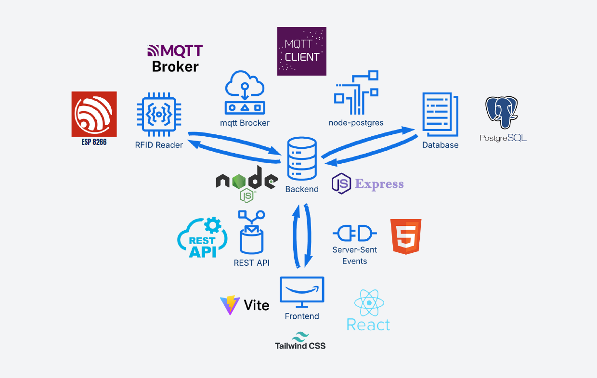

<div align="center">

# 🎫 RFID Tapping System

### Production-Ready Event Management & Visitor Tracking

*Real-time analytics • Interactive gaming • IoT integration*

[](https://github.com/cepdnaclk/e21-co227-RFID-Hardware-and-Tag-Lifecycle)
[](https://github.com/cepdnaclk/e21-co227-RFID-Hardware-and-Tag-Lifecycle)
[](https://github.com/cepdnaclk/e21-co227-RFID-Hardware-and-Tag-Lifecycle)

</div>

---

<div align="center">

## 🎯 What is this?

An **intelligent RFID-based system** designed for large-scale events like exhibitions and conferences. It combines IoT hardware, real-time data processing, and interactive dashboards to transform how events track visitors, manage crowds, and engage attendees.

**Built for EngEx 2025** - University of Peradeniya

</div>

---

<div align="center">

## ✨ Key Features

<table>
<tr>
<td width="50%">

<h3>🔄 Real-Time Tracking</h3>
<ul>
<li>Instant RFID card detection</li>
<li>Live visitor flow monitoring</li>
<li>Multi-zone booth tracking</li>
<li>FIFO queue management</li>
</ul>

</td>
<td width="50%">

<h3>📊 Smart Analytics</h3>
<ul>
<li>Real-time crowd metrics</li>
<li>Historical trend analysis</li>
<li>Venue occupancy insights</li>
<li>Visitor behavior patterns</li>
</ul>

</td>
</tr>
<tr>
<td width="50%">

<h3>🎮 Interactive Gaming</h3>
<ul>
<li>Team-based scoring system</li>
<li>Live leaderboards</li>
<li>Achievement tracking</li>
<li>Engagement rewards</li>
</ul>

</td>
<td width="50%">

<h3>🛠️ Admin Control</h3>
<ul>
<li>System configuration panel</li>
<li>Live event monitoring</li>
<li>User management</li>
<li>Complete data control</li>
</ul>

</td>
</tr>
</table>

</div>

---

<div align="center">

## 🏗️ How It Works



<p>
📡 <strong>RFID readers</strong> detect cards at registration, exits, and activity zones <br>
🔄 <strong>MQTT broker</strong> routes messages in real-time across the system <br>
⚙️ <strong>Backend API</strong> processes events, updates database, and manages game logic <br>
📊 <strong>Live dashboards</strong> display analytics, leaderboards, and admin controls <br>
🎮 <strong>Interactive interface</strong> engages visitors with games and feedback
</p>

</div>

---

<div align="center">

## 💻 Technology Stack

| Component | Technology |
|-----------|------------|
| **Hardware** | ESP8266 + RDM6300 RFID (125kHz) |
| **IoT** | MQTT (Mosquitto), WiFi, JSON |
| **Backend** | Node.js, Express, WebSocket |
| **Frontend** | React, Vite, TailwindCSS |
| **Database** | PostgreSQL |
| **Testing** | Jest, Vitest (1,455+ tests) |

</div>

---

<div align="center">

## 🚀 Quick Start

**One command deployment:**

</div>

```powershell
# Run with default settings
.\deploy-local.ps1

# Or customize with parameters
.\deploy-local.ps1 -PgPassword "YourPassword" -BackendPort 4000

# When done, press ENTER to automatically cleanup everything
```

<div align="center">

**Access your system:** <br>
🌐 **Dashboard**: http://localhost:5173 <br>
🔌 **API**: http://localhost:4000 <br>
💾 **Database**: localhost:5432 <br>
📡 **MQTT**: localhost:1883 <br>

**Automatic Cleanup:** Press ENTER when finished to stop all services, close windows, stop Mosquitto, and drop database (unless `-NoDropDb` specified).

> 📖 **Need more details?** Check the [complete documentation](https://github.com/cepdnaclk/e21-co227-RFID-Hardware-and-Tag-Lifecycle/blob/58fa5ad16faed29d805a64dbd598fc3b583b5a35/README.md) or [deployment guide](https://github.com/cepdnaclk/e21-co227-RFID-Hardware-and-Tag-Lifecycle/blob/58fa5ad16faed29d805a64dbd598fc3b583b5a35/DEPLOYMENT.md) for all available parameters and options.

</div>

---

<div align="center">

## 📊 System Highlights <br>

✅ **Production Ready** - Fully tested and deployment-ready <br>
🧪 **99.9% Test Success** - 1,455+ passing tests across all components <br>
📈 **89% Code Coverage** - Comprehensive test coverage <br>
🔒 **Secure** - No hardcoded credentials, proper secret management <br>
🎨 **Modern UI** - Responsive design for mobile and desktop <br>
⚡ **Real-Time** - Live updates via WebSocket and MQTT <br>
🔧 **Easy Setup** - Single-script automated deployment <br>

</div>

---

<div align="center">

## 👥 Team 

**University of Peradeniya - Department of Computer Engineering** <br>
S. Ganathipan - [e21148@eng.pdn.ac.lk](mailto:e21148@eng.pdn.ac.lk) <br>
V.G. Amirsha - [e21152@eng.pdn.ac.lk](mailto:e21152@eng.pdn.ac.lk) <br>
K. Kartheepan - [e21214@eng.pdn.ac.lk](mailto:e21214@eng.pdn.ac.lk) <br>
S. Kavishanthan - [e21220@eng.pdn.ac.lk](mailto:e21220@eng.pdn.ac.lk) <br>

**Supervisor:** Ms. Yasodha Vimukthi ([yasodhav@eng.pdn.ac.lk](mailto:yasodhav@eng.pdn.ac.lk))

</div>

---

<div align="center">

## 🔗 Links

📦 [**GitHub Repository**](https://github.com/cepdnaclk/e21-co227-RFID-Hardware-and-Tag-Lifecycle) - View source code <br>
📖 [**Complete Documentation**](https://github.com/cepdnaclk/e21-co227-RFID-Hardware-and-Tag-Lifecycle/blob/58fa5ad16faed29d805a64dbd598fc3b583b5a35/README.md) - Detailed setup & API docs <br>
🚀 [**Deployment Guide**](https://github.com/cepdnaclk/e21-co227-RFID-Hardware-and-Tag-Lifecycle/blob/58fa5ad16faed29d805a64dbd598fc3b583b5a35/DEPLOYMENT.md) - Step-by-step installation <br>
🏛️ [**Department of Computer Engineering**](http://www.ce.pdn.ac.lk/) <br>
🎓 [**University of Peradeniya**](https://eng.pdn.ac.lk/) <br>

</div>

---

<div align="center">

## 🎓 Academic Context

**Course:** CO227 Computer Engineering Project  <br>
**Institution:** University of Peradeniya  <br>
**Year:** 2024-2025  <br>
**Event:** EngEx 2025 - Engineering Exhibition <br>

This project demonstrates the integration of IoT hardware, real-time systems, web technologies, and database management to solve real-world event management challenges.

</div>

---

<div align="center">

**Made with ❤️ for EngEx 2025**
*Transforming event experiences through intelligent RFID technology*

</div>