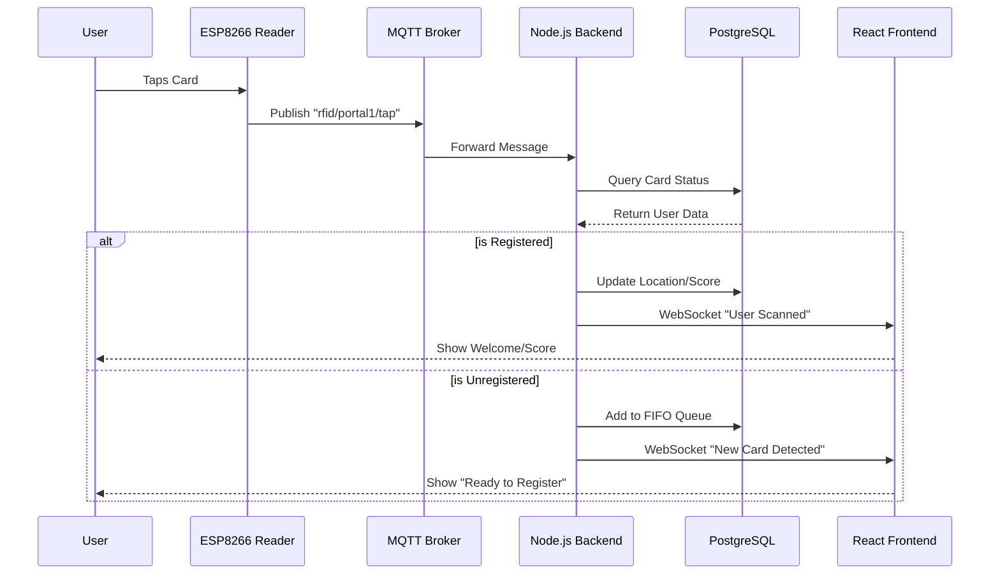

# System Architecture

The RFID Tapping System is built on a robust, event-driven architecture designed for high reliability and real-time performance.

## High-Level Overview

  

The system consists of four main layers:

1.  **Hardware Layer**: ESP8266 microcontrollers with RDM6300 RFID readers capture card taps.
2.  **Messaging Layer**: A Mosquitto MQTT broker handles real-time communication between hardware and the backend.
3.  **Backend Layer**: A Node.js/Express server processes events, manages game logic, and interfaces with the database.
4.  **Frontend Layer**: A React SPA provides real-time dashboards for admins and users.

## Data Flow

### 1. Card Tap Event
When a user taps their RFID card:
- The **RDM6300** reader detects the card ID.
- The **ESP8266** firmware publishes a JSON message to the MQTT topic `rfid/{portal_id}/tap`.
- **Payload**: `{ "tag": "A1B2C3D4", "timestamp": 1234567890 }`

### 2. Event Processing
- The **Backend Service** subscribes to `rfid/#` topics.
- It receives the message and normalizes the data.
- The system checks if the card is registered.
    - **If Registered**: Updates the user's location/score in the database.
    - **If Unregistered**: Adds the card to a FIFO queue for registration.

### 3. Real-Time Updates
- The backend emits a **WebSocket** event to connected frontend clients.
- The **Dashboard** updates immediately to show the new scan, updated score, or crowd count.

## Sequence Diagram

