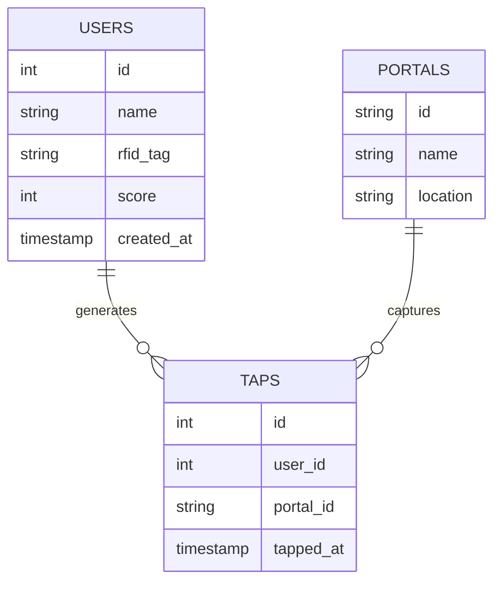

# Backend Implementation

The backend is the brain of the operation, orchestrating communication between hardware, database, and frontend. It is built with **Node.js** and **Express**, designed for high concurrency and low latency.

  Node.js
  Express
  PostgreSQL
  MQTT.js
  Socket.IO

## Core Services

### 1. MQTT Ingestion Service
This service subscribes to the Mosquitto broker and processes every incoming RFID tap.
- **Debouncing**: Prevents duplicate processing if a user holds their card against the reader.
- **Normalization**: Converts raw hardware payloads into standardized event objects.

### 2. Game Logic Engine
Calculates scores and achievements in real-time.
- **Rules Engine**: Configurable rules for points (e.g., "First visit = 10pts", "Group of 5 = 50pts").
- **Leaderboard**: Updates global rankings instantly upon score changes.

### 3. REST API
Provides endpoints for the frontend to fetch historical data and manage configuration.
- **Secure**: JWT-based authentication for admin routes.
- **Documented**: Full Swagger/OpenAPI documentation.

## Database Schema

The system uses **PostgreSQL** for reliable data storage.

## Testing Strategy
We maintain a high standard of code quality with over **99.9% test pass rate**.
- **Unit Tests**: For all utility functions and game logic.
- **Integration Tests**: For API endpoints and database interactions.
- **End-to-End Tests**: Simulating full user flows from tap to dashboard update.

